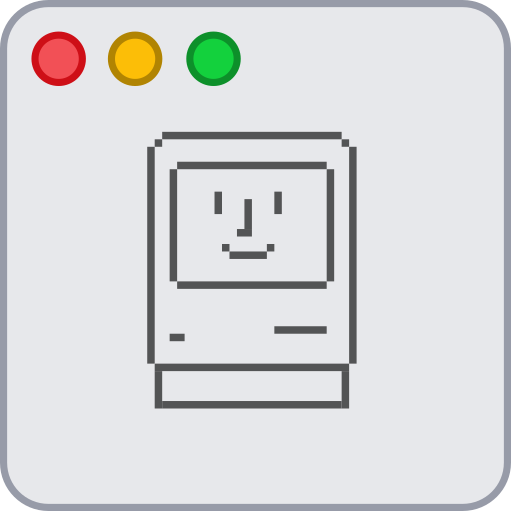

<p align="center"></p>

<h1 align="center">BreezewayMod</h1>

**BreezewayMod** is a fork of the  window decoration, which aims to mimic macOS' window decorations, but with **power ups**.

It also works great with the  KWin script.

## Preview


Looks great  with light and dark color schemes. Shown here with  and  color schemes.

| Feature | Screenshot |
| --- | --- |
| Titlebars can use the color supplied by your system's color scheme... |  |
| ...or match the window color of your color scheme... |  |
| ...or manually use a custom color picker to paint the titlebar and perfectly match even GTK applications! |  |
| Shadows and highlight lines make sure you don't lose track of your windows in low contrast environments. |  |
| Embrace flat design, or use gradients and a titlebar separator; your choice! BreezewayMod will use your chosen color profile to bring you a smooth interface that fits _your_ desktop. |   |
| A nice, clean settings page gives you granular control over the theme's features. |  |
| Take customization to the next level with window specific settings, enabling you to mix and match settings and colors just the way you like it. |  |
| Support for HiDPI screens comes out of the box as well. Just increase size of titlebar, buttons and border radius and you're all set. | 
| Hovering over window buttons reveals additional icons. You can choose to also always show the icons. |  |

## Building and Installation

### Automated Installation

Thanks to nice people on the internet, you can make use of easy and automated build processes. If your distribution is not listed here, [check out how to build from source](#manual-installation).

Note: I don't maintain any of these so make sure you check out the package source before blindly installing them.

#### Arch Linux / AUR

```
yay -S breezeway-mod-git
```
Source: https://aur.archlinux.org/packages/breezeway-mod-git/ by ToxicSalt

### Manual Installation

Before proceeding with the actual installation process, make sure you have the following dependencies installed:

* cmake
* g++ / clang
* extra-cmake-modules
* libkdecorations2-dev
* libkf5guiaddons-dev
* libkf5configwidgets-dev
* libkf5windowsystem-dev
* libkf5package-dev
* libqt5x11extras5-dev
* gettext
* pkg-config *(optional)*

Download the [latest stable release](https://github.com/n4n0GH/breezeway-mod/releases) or clone this repository for bleeding edge builds:

```
git clone https://github.com/n4n0GH/breezeway-mod
```
It's recommended to clone the repository to where you can leave the built directory, just in case you want to uninstall **BreezewayMod**. However, if you accidentally removed the directory, please check below for manually uninstallation instructions.

Change to `breezeway-mod` directory and create a new directory called `build`:

```
cd breezeway-mod && mkdir build && cd build
```

To install, use `cmake`, `make` and `make install`:

```
cmake -DCMAKE_INSTALL_PREFIX=/usr ..
make && sudo make install
```

It may be necessary to restart the KWin window manager after that, so either reboot your machine, or do it the cool way:

```
kwin_x11 --replace &
```

## Uninstalling

In the build directory, run:

```
sudo make uninstall
```

If you removed the installation directory, you'll have to delete the following files and folders:

```
/usr/lib64/cmake/BreezewayMod/BreezewayConfig.cmake
/usr/lib64/cmake/BreezewayMod/BreezewayConfigVersion.cmake
/usr/lib64/qt/plugins/org.kde.kdecoration2/breezewaydecoration.so
/usr/share/kservices5/breezewaydecorationconfig.desktop
/usr/lib64/libbreezewaycommon5.so.5.16.5
/usr/lib64/libbreezewaycommon5.so.5
```

## Contribution

If you have any questions regarding **BreezewayMod**, you are welcome to [open an issue](https://github.com/n4n0GH/breezeway-mod/issues).

## FAQ

**Q: What's the biggest differences between this theme and [Breezeway](https://github.com/richard-kung/breezeway)?**  

A: As of now there are  that it's fair to say it's a completely different theme.

**Q: I can see this theme in the KDE store, but I can't install it through KDE's settings menu, what's up with that?**

A: The KDE store is meant to provide easy access to Aurorae themes and KDE's settings menu is pretty good at downloading those themes and moving them around. BreezewayMod is written in C++ and not using the Aurorae engine. Sorry to say, but you're going to have to get your hands dirty in the terminal.

**Q: Why is blur not enabled by default on this theme?**

A: There's a massive ongoing issue with the KDecoration2 framework which will treat the titlebar - and windows in general - as if they had 90° corners, i.e. perfectly rectangular shapes. This leads to something I call "blur bleed", which enables you to see the blur effect being rendered _underneath_ the window when your theme uses rounded corners. This affects regular Aurorae themes and QML themes alike. Read more about it on the KDE bugtracker: https://bugs.kde.org/show_bug.cgi?id=395725

| Description | Showcase |
| --- | --- |
| This glitch in action. |  |
| BreezewayMod doesn't have that problem because it doesn't rely on blur features until KDecoration2 gets fixed. |  |

**Q: But I really don't care about the glitches, I just want blur! How can I do this?**

A: Find the `breezeway.json` file inside the `kdecoration` directory. [On line 12](https://github.com/n4n0GH/breezeway-mod/blob/master/kdecoration/breezeway.json#L12) you switch out `"blur": false,` with `"blur": true,` and then compile the theme according to the instructions. 

**Q: Does this work on Wayland?**

A: Maybe. Some functions may not work out of the box and if scaling is used the theme will most likely break. Once Wayland is stable on my own system, I'll get around to fix that though. But as of now you're on your own.